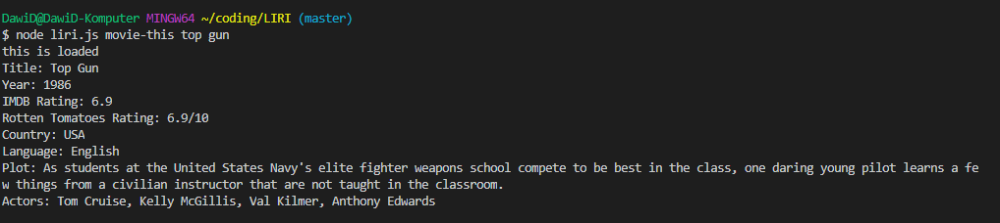

# **LIRI** Application
## LIRI is a Language Interpretation and Recognition Interface. LIRI is a command line node app that takes in parameters and gives you back data.
### In this case Liri giving back three types of informations:
1. Informations about specific songs from Spotify API,
2. Informations about specific movies form OMDG API,
3. Informations about specific artist's concerts form Band In Town API

# How to run LIRI application

## To get informations about your lovely **song** you need to type command in the terminal. For example:
node liri.js spotify-this-song *name your favorite song*

## To get informations about your favorite **movie** you need to type command in the terminal. For example:
node liri.js movie-this *name your favorite movie*

## To get informations about your favorite **band**  you need to type command in the terminal. For example:
node liri.js spotify-this-song *name your favorite band*

# Examples:

### Spotify API

### OMDB API

### Band in Town API

